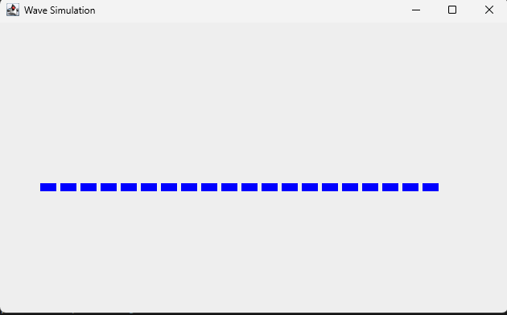

<h1>Wave Simulation</h1>

<main>
  
Wave Simulation is a personal project I did to practice my own java skills. 
    Your goals is to make blocks simulate waves as screen shakes.
  

  

  <h3>Running Program</h3>
  
</main>
